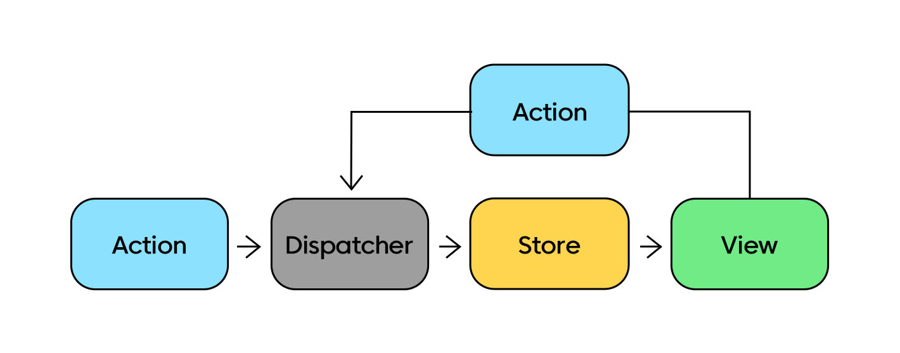
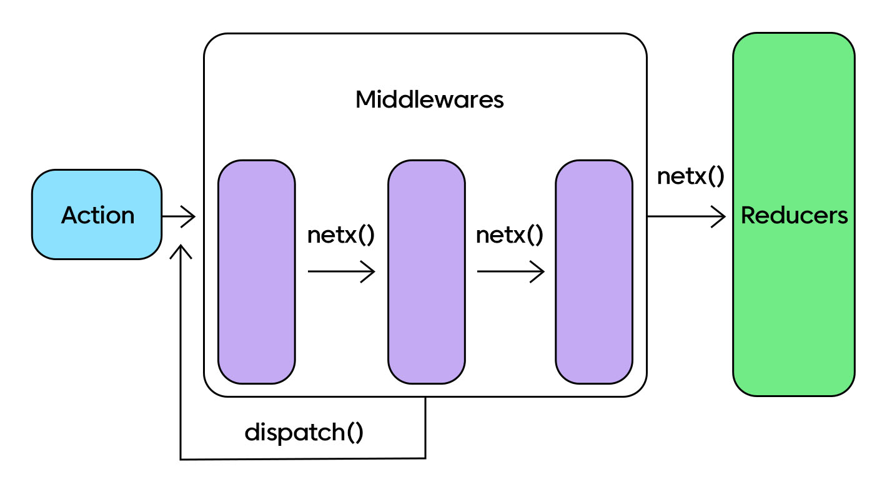

# state Mangement2

## Redux ToolKit

- `redux`통한 상태 관리의 피로도 증가와 함께 불만

- React Query, SWR 등 강력한 데이터 패칭과 캐싱 라이브러리를 통해 `Redux`의 인기는 줄어들고 있음

- 그렇지만 알고서 안사용하지 않는것과 모르고 사용하지 않는것은 엄연히 다름

- `Redux`는 FLUX아키텍처의 구현체로 데이터의 흐름을 예측하기 어려웠지만 문제를 해결하기 위해 고안 (페이스북 채팅 버그)

<p align="center"></p>

- 이를 해결하고자 하나의 `Store`에 데이터를 저장하고 `Action`,`Dispatch`를 통해 데이터를 사용, `Reducer`를 통해 `Action`이 어떤 상태를 변경하는지를 나타냄


## RTK의 주축이 되는 함수들 

### configureStore()

- `Store`를 구성하는 함수로 기존의 `Redux`의 `createStore`를 추상화한것 

```js

import { configureStore } from '@reduxjs/toolkit'

import rootReducer from './reducers'

const store = configureStore({ reducer: rootReducer })
```


- 위처럼 선언하면 기본 미들웨어로 `redux-thunkl`를 추가하고 개발환경에서 `Redux DevTools`를 활성화

```js
// Dtail example

import logger from 'redux-logger'
import { reduxBatch } from '@manaflair/redux-batch'

import todosReducer from './todos/todosReducer'
import visibilityReducer from './visibility/visibilityReducer'

const rootReducer = {
  todos: todosReducer,
  visibility: visibilityReducer,
}

const preloadedState = {
  todos: [
    {
      text: 'Eat food',
      completed: true,
    },
    {
      text: 'Exercise',
      completed: false,
    },
  ],
  visibilityFilter: 'SHOW_COMPLETED',
}

const store = configureStore({
  reducer,
  middleware: (getDefaultMiddleware) => getDefaultMiddleware().concat(logger),
  devTools: process.env.NODE_ENV !== 'production',
  preloadedState,
  enhancers: [reduxBatch],
})

```
- `configure` 함수는 `reducer`,`middleware`,`devtools`,`preloadedState`,`enchancer`를 전달

- `reducer` : 함수를 전달하여 스토어의 루트 리듀서로 바로 사용가능, 또한 슬라이스 리듀서들로 구성된 객체를 전달하여 루트 리듀서를 생성 가능하게 함

- `middleware` : 리덕스 미들웨어를 담는 배열, 사용할 모든 미들웨어를 배열에 담아서 명시적으로 작성 가능. 적지 않는다면 `getDefaultMiddleware`를 호출 

- `devTools` : 리덕스 개발자 도구

- `preloadedState` : 스토어의 초기값을 설정

- `enchaners`: Default는 배열이지만, 콜백으로도 정의 가능

### Redux middleware

- `middleware` : `dispatcher`된 액션이 `reducer`에 도달하기전 중간 영역에서 사용자의 목적에 맞게 기능을 확장 하는것

<p align="center"></p>

```js
const customMiddleware = (storeApi) => {
  return (next) => {
    return (action) => {
      // Code Input
      return next(action);
    };
  };
};

const store = configureStore({
  middleware = (getDefaultMiddleware) => 
    getDefaultMiddleware().concat(customMiddleware)
});

```

### createReducer()

- 상태에 변화를 일으키는 리듀서 함수를 생성하는 함수

- 내부적으로 immer 라이브러리를 사용하여 `mutative`한 코드

- createReducer는 크게 2가지 방법으로 나누어진다. builder Callback, Map object
```js
const increment = createAction('increment')
const decrement = createAction('decrement')

function isActionWithNumberPayload(
  action: AnyAction
): action is PayloadAction {
  return typeof action.payload === 'number'
}

const initialState = {
  counter: 0,
  sumOfNumberPayloads: 0,
  unhandledActions: 0,
};

const counterReducer = createReducer(initialState, (builder) => {
  builder
    .addCase(increment, (state, action) => {
      state.counter += action.payload
    })
    .addCase(decrement, (state, action) => {
      state.counter -= action.payload
    })
    .addMatcher(isActionWithNumberPayload, (state, action) => {})
    .addDefaultCase((state, action) => {})
})

```
- `createReducer`의 콜백 함수 인자로 주어지는 `builder`객체는 `addCase`,`addMatcher`,`addDefaultCase`라는 메서드를 제공

- `addCase` : 액션 타입과 맵핑되는 케이스 리듀서를 추가하여 액션을 처리, `addMatcher` 또는 `addDefaultCase`메서드 보다 먼저 작성

- `addMatcher` : 새로 들어오는 모든 액션에 대해서 주어진 패턴과 일치하는지 확인후 리듀서 실행

- `addDefaultCase` : 그 어떤 케이스 리듀서나 매처 리듀서도 실행되지 않았다면, 기본 케이스 리듀서가 실행

```js

const increment = createAction('increment')
const decrement = createAction('decrement')

const counterReducer = createReducer(0, {
  [increment]: (state, action) => state + action.payload,
  [decrement.type]: (state, action) => state - action.payload
})
```

### CreateAction()

- 기존 리덕스는 `액션타입 상수` 와 `액션 생성자 함수`를 분리하여 선언하였음

- RTK 부터는 `createAction`을 통해 하나로 추상화

```js
//BEFORE
const INCREMENT = 'counter/increment'

function increment(amount) {
  return {
    type: INCREMENT,
    payload: amount,
  }
}

const action = increment(3)

//AFTER
import { createAction } from '@reduxjs/toolkit'

const increment = createAction('counter/increment')

const action = increment(3)

// { type: 'counter/increment', payload: 3 }

```

- 위 예제를 보면 payload의 설정을 자동으로 설정되는데 이것을 정의하고 싶다면 `prepare callback` 함수를 사용한다

```js
import { createAction, nanoid } from '@reduxjs/toolkit'

const addTodo = createAction('todos/add', function prepare(text: string) {
  return {
    payload: {
      text,
      id: nanoid(),
      createdAt: new Date().toISOString(),
    },
  }
})
```

### createSlice()

```js
const alertSlice = createSlice({
  name: 'todos',
  initialState,
  reducers: {},
  extraReducers: (builder) => {
  builder.addCase(fetchUserById.fulfilled, (state, action) => {
    state.entities.push(action.payload)
  })
  },
});
```

- `createSlice`를 사용하면 `createAction`, `createReducer`를 작성할 필요가 없습니다.

- `extraReducer`는 `createslice`가 생성한 액션 타입 외 다른 액션타입에 응답하게 한다

### createAsyncThunk

- `createAsyncThunk`는 `createAction`의 비동기 버전

### createSelector

- 리덕스 스토어 상태에서 데이터를 추출할 수 있도록 도와주는 유틸리티로 `Reselect`라이브러리에서 제공하는 함수를 가져온것

```js
const users = useSelector((state) => state.users)
```

- `Reselect`라이브러리를 살펴보면 `createSelector` 함수가 memoization, 즉 이전에 계산한 값을 메모리에 저장하여 값이 변경 되었을 경우에만 계산하도록 할수 있다.


### createEntityAdapter

- 정규화된 상태 구조, 즉 중복을 최소화 하기위해서 데이터가 구조화되고 일관성이  보장된 구조에서 효율적은 CRUD를 수행하기 위한 함수
